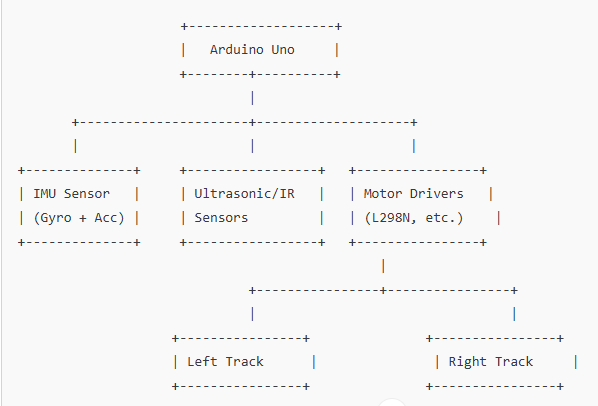

# PART-A: StepXplorer Robot Design

## Robot Name
**StepXplorer**

## Mechanism Chosen
**Tracked Mechanism (Crawler System)**

## Why Tracked Mechanism?
I chose a tracked mechanism for StepXplorer because it’s ideal for stair climbing. Here’s why:
- **Excellent Traction**: Tracks distribute the robot’s weight, providing strong grip on stair edges, unlike wheels that might slip.
- **Handles Varied Steps**: Tracks can roll over different step heights easily, without needing precise leg placement like legged robots.
- **High Stability**: Tracks keep constant contact with the surface, reducing tipping risks compared to wheeled robots.
- **Simpler Control**: Tracks require less complex programming than legged systems, making real-time navigation manageable.

Compared to other options:
- **Wheeled Robots**: Struggle with stair edges and are prone to tipping.
- **Legged Robots**: Require intricate balance and control, which is too complex for this project.
- **Hybrid Systems**: Combine complexity without clear advantages for stairs.

## Stability and Power Considerations
To ensure StepXplorer is stable and powerful:
- **Low Center of Mass**: Heavy components (battery, motors) are placed near the base to prevent tipping on inclines.
- **Wide Track Base**: Tracks are spaced apart for lateral stability on narrow stairs.
- **Power Supply**: An **11.1V Li-ion battery** provides ample energy.
- **Motors**: **High-torque DC gear motors** deliver the force needed to climb 15–20 cm steps at 30–45° angles.
- **Tread Design**: **Rubber-coated tracks** enhance grip to avoid slipping.

## Sensors and Control Strategy
StepXplorer uses these sensors for navigation:
- **IMU (Gyroscope + Accelerometer)**: Monitors tilt and orientation to maintain balance.
- **Ultrasonic Sensors**:
  - **Front**: Detects the distance to the next step.
  - **Bottom**: Measures step height for climbing adjustments.
- **IR Sensor**: Identifies stair edges to prevent falls.
- **Motor Encoders**: Ensure both tracks move in sync by tracking motor rotations.
- **Optional Camera (OV7670)**: Could add visual detection but omitted for simplicity.

The **Arduino Uno** processes sensor data and controls motors. An **ESP32** could be used for more processing power if needed.

## Real-Time Adaptation
StepXplorer climbs stairs as follows:
1. **Bottom Ultrasonic Sensor**: Measures step height.
2. **Front Ultrasonic Sensor**: Confirms step proximity.
3. **Arduino**: Adjusts motor speeds to lift tracks over the step.
4. **IMU**: Detects tilt and tweaks motor speeds to stay balanced (e.g., slows one track if tilting).
5. **Encoders**: Verify both tracks move together to avoid veering.

## Rough Sketch
