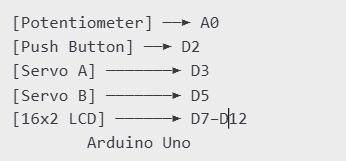

# PART-C: Servo Switching System

## Overview
This system uses an Arduino Uno to control two servo motors (Servo A and Servo B):
- A **pushbutton** toggles between Servo A and Servo B.
- A **potentiometer** sets the angle of the active servo (0° to 180°).
- A **16x2 LCD** displays the active servo (“Servo: A” or “Servo: B”) and its angle (e.g., “Angle: 90”).

## Diagram

